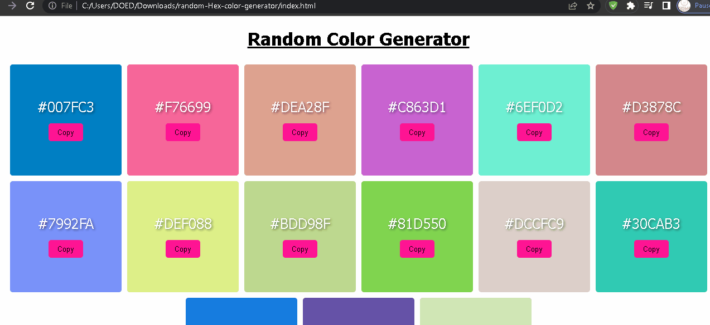

# Random Hexadecimal Color Generator
This generator generates the randome color every time you refresh the DOM, with their respective color codes and copy the code as soon as you click on the copy button.

#Note `This project is only build up with the plain JS code`

## Project Demo
